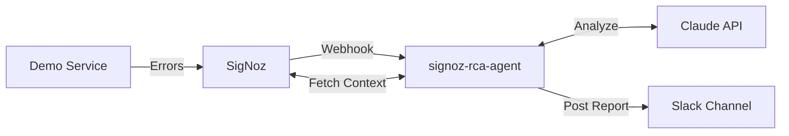

# signoz-rca-agent

`signoz-rca-agent` is an automated root cause analysis (RCA) agent designed to act as a smart webhook receiver for SigNoz alerts. When an alert triggers, the agent fetches the corresponding telemetry window (traces and logs), utilizes the Anthropic Claude API to synthesize a diagnostic summary, and dispatches an actionable report directly to Slack.

## Architecture

The system consists of three main components:

1. **SigNoz (Observability Backend)**
   - Receives telemetry data via OpenTelemetry (OTLP).
   - Evaluates alert thresholds and dispatches webhooks to the `signoz-rca-agent`.

2. **signoz-rca-agent (AI Webhook Receiver)**
   - A FastAPI service listening for incoming alert webhooks.
   - Queries SigNoz for the raw telemetry window surrounding the alert timestamp.
   - Formats the telemetry and submits it to Claude for RCA synthesis.
   - Posts the final formatted markdown report to a designated Slack channel.

3. **Demo Service (Test Target)**
   - A sample FastAPI application instrumented with OpenTelemetry.
   - Provides endpoints to simulate normal traffic and force HTTP 500 errors to trigger alerts.

### The Alert Flow



## Prerequisites

- Python 3.11+
- Docker and Docker Compose
- Anthropic API Key
- Slack Webhook URL

## Project Structure

```
signoz-rca-agent/
├── agent/                  # Core AI Agent Service
│   ├── config.py           # Environment configuration management
│   ├── main.py             # FastAPI entrypoint and webhook route
│   ├── slack.py            # Slack webhook integration
│   ├── summarizer.py       # Anthropic Claude prompt and integration
│   └── telemetry.py        # SigNoz API integration for trace fetching
├── demo-service/           # Instrumented application for testing
│   └── main.py             # FastAPI app with error simulation endpoints
├── signoz/                 # Cloned SigNoz repository for local deployment
├── .env                    # Environment variables configuration
└── requirements.txt        # Python dependencies
```

## Setup and Installation

### 1. Environment Configuration

Create a `.env` file in the root directory based on `.env.example`:

```env
SIGNOZ_QUERY_URL=http://localhost:8080/api/v3/query_range
SIGNOZ_TOKEN=<your_jwt_token_from_signoz>
ANTHROPIC_API_KEY=<your_anthropic_api_key>
SLACK_WEBHOOK_URL=<your_slack_webhook_url>
```

### 2. Install Dependencies

It is recommended to use a virtual environment:

```bash
python3 -m venv .venv
source .venv/bin/activate
pip install -r requirements.txt
```

### 3. Deploy Local SigNoz

Run the local SigNoz cluster using the provided docker-compose configuration:

```bash
cd signoz/deploy/docker/clickhouse-setup
docker-compose up -d
```

Access the SigNoz dashboard at `http://localhost:3301` to complete the initial setup and retrieve a JWT token for the `.env` file if querying the API securely.

## Running the Services

### Start the signoz-rca-agent

In a new terminal window, activate your virtual environment and start the agent:

```bash
source .venv/bin/activate
uvicorn agent.main:app --port 8000
```

The agent will listen for webhooks at `http://localhost:8000/alert`.

### Start the Demo Service

In a separate terminal window, start the instrumented test service:

```bash
source .venv/bin/activate
export OTEL_SERVICE_NAME=demo-service
opentelemetry-instrument \
    --traces_exporter otlp \
    --metrics_exporter otlp \
    --logs_exporter none \
    uvicorn demo-service.main:app --port 8001
```

### Triggering Alerts

1. Configure an alert in the SigNoz dashboard targeting the `demo-service` with a webhook destination pointing to the running agent (`http://host.docker.internal:8000/alert`).
2. Generate an error spike by curling the demo service:

```bash
# Enable errors
curl -X POST "http://localhost:8001/break?enable=true"

# Send traffic to trigger the alert
for i in {1..20}; do curl -s http://localhost:8001/ > /dev/null; sleep 0.5; done
```

The agent will automatically receive the webhook, pull the trace data, formulate the RCA with Claude, and send the final report to Slack.
